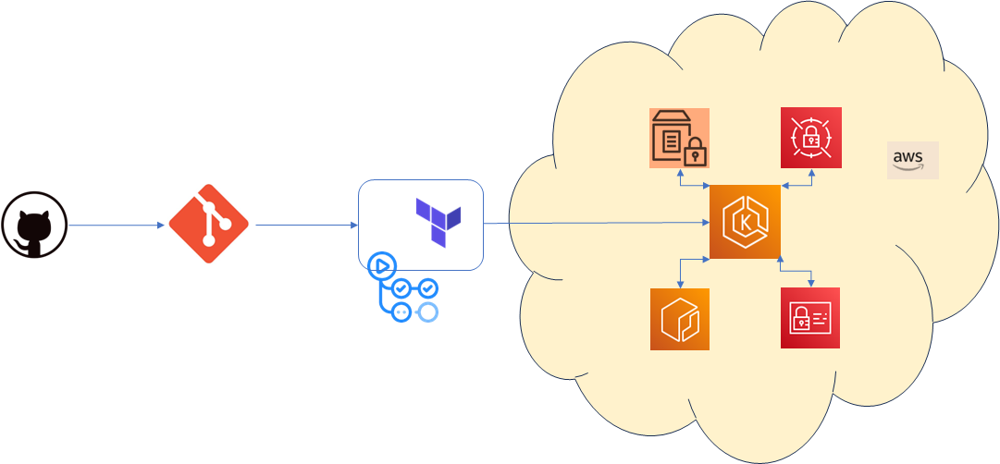

# EKS Deployment with Terraform and GitHub Actions

Welcome to the **EKS Deployment with Terraform and GitHub Actions** repository! This repository contains the code and resources related to the blog post [From Code to Cloud: Mastering EKS Deployment with Terraform and GitHub Actions](https://www.sourishchakraborty.com/post/from-code-to-cloud-mastering-eks-deployment-with-terraform-and-github-actions) by Sourish Chakraborty.

## Project Overview

This project demonstrates the seamless deployment of applications on Amazon EKS using Terraform and GitHub Actions. The main goal is to provide a comprehensive guide and example for deploying and managing Kubernetes-based applications in an efficient and secure manner.

The project's key features include:

- Leveraging AWS services such as Parameter Store and Secrets Manager for secure configuration management.
- Utilizing GitHub Actions for automated Continuous Integration and Continuous Deployment (CI/CD) pipelines.
- Implementing Infrastructure as Code (IaC) principles with Terraform to provision and manage EKS clusters, networking, and application resources.

## Repository Structure

The repository is organized as follows:

- `/terraform/infra-deployments`: Contains Terraform configurations for provisioning EKS clusters, networking, and other resources.
- `/terraform/platform-deployments`: Contains the application stack code that will be deployed to the EKS cluster.
- `.github/workflows`: Contains GitHub Actions workflow files for CI/CD pipelines.

## Getting Started

To get started with this project:

1. Clone this repository: `git clone https://github.com/sochaty/eks-with-tf.git`
2. Navigate to the `/terraform` directory and customize the Terraform configurations as needed.
3. Review and modify the application stack code in the `/terraform/platform-deployments` directory to match your application requirements.
4. Set up appropriate AWS credentials and permissions for Terraform and GitHub Actions.
5. Refer to the blog post [From Code to Cloud: Mastering EKS Deployment with Terraform and GitHub Actions](https://www.sourishchakraborty.com/post/from-code-to-cloud-mastering-eks-deployment-with-terraform-and-github-actions) for detailed instructions on deploying and managing the EKS cluster and application stack.

## Contributing

Contributions to this project are welcome! If you find any issues or have improvements to suggest, feel free to submit a pull request.

## License

This project is licensed under the [MIT License](LICENSE).

---

For a detailed guide and insights into the implementation, please refer to the blog post [From Code to Cloud: Mastering EKS Deployment with Terraform and GitHub Actions](https://www.sourishchakraborty.com/post/from-code-to-cloud-mastering-eks-deployment-with-terraform-and-github-actions) by Sourish Chakraborty.

For more information about the author and other projects, visit [Sourish Chakraborty's website](https://www.sourishchakraborty.com/).
