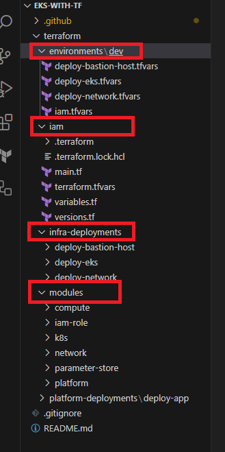
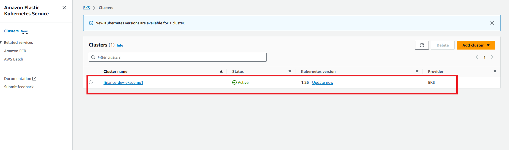
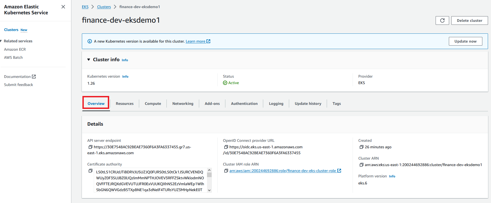

# From Code to Cloud: Mastering EKS Deployment with Terraform and GitHub Actions

## Introduction

In the ever-evolving landscape of cloud computing, deploying and managing applications with reliability and scalability is crucial. This project showcases the utilization of various AWS services and tools to achieve seamless deployment of an Elastic Kubernetes Service (EKS) cluster and application deployment on Amazon's EKS using Terraform and GitHub Actions. Building upon the insights shared in the blog "Exploring AWS EKS with eksctl," we will explore a comprehensive implementation that leverages AWS Parameter Store, AWS Secrets Manager, AWS EKS, and AWS Network Services, coupled with the power of GitHub Actions for CI/CD.

## Technologies Used

### AWS Systems Manager/ Parameter Store

The AWS Parameter Store is a managed service that allows you to store configuration data securely. In this project, the AWS Parameter Store is employed to store inputs for the EKS cluster configuration. This ensures that sensitive information is kept separate from the codebase and can be dynamically retrieved during deployment.

### AWS Secrets Manager

Securing sensitive information like SSH keys is paramount. AWS Secrets Manager offers a secure and scalable solution for storing, distributing, and rotating secrets. The project utilizes this service to securely manage SSH secret key files required for accessing the Bastion Host.

### AWS EKS

Amazon EKS simplifies the process of deploying, managing, and scaling containerized applications using Kubernetes. The project sets up an EKS cluster with public and private node groups, each running a desired number of EC2 instances. This architecture provides a balance of security and accessibility.

### AWS Network Services

The custom VPC and its components, including subnets and security groups, play a pivotal role in creating a secure and isolated networking environment for the EKS cluster and other resources. Properly configuring these components is essential for maintaining a robust infrastructure.

## Building Infrastructure Stack

We are going to build an AWS EKS cluster within a custom multi-tier network. Deployed cloud components will contain an EKS control plane, an EKS data plane with public and private node-groups, IAM roles for the cluster as well as node-groups, and a bastion host EC2 instance in the public subnet to connect the worker EC2 node instances.

A custom VPC cloud with it’s all the required components will also get deployed in the due process. We will deploy a VPC with two different Subnets. One subnet will be public and one will be private. NAT Gateway will get deployed in one of the public subnets and it’s routes will be registered in the route table to give incoming traffic to worker nodes deployed in the private node group.

All these cloud components will be deployed by using a terraform codebase with workflow defined in GitHub Actions. After a successful deployment of the infrastructure stack, we can access various EKS components using AWS console and kubectl cli utility.

## Infrastructure Code Structure

The above figure shows the codebase highlighted by red boxes is for infrastructure deployment. **infra-deployment** code section has three different main execution sections. **deploy-bastion-host** is for deploying EC2 instances in the public subnet, this EC2 instance can connect to EKS worker nodes via port 22(SSH protocol). **deploy-network** builds the custom VPC network. **deploy-eks** deploys the AWS EKS cluster on a custom VPC network. Bastion host code uses a **compute** module. Network and EKS cluster build uses **network** and **k8s** modules for deploying cloud components. Just above the **infra-deployments** codebase section, there is **iam** codebase, which uses **iam-role** module to deploy cluster and node group-specific IAM roles. **environments** folder contains all terraform input variable values for the dev environment.

## Building Application/Platform Stack

We are going to deploy a simple application stack by using Kubernetes Terraform provider. The application stack will use a Nginx image from docker and deploy application pod and Kubernetes Load Balancer Service, the service type will be AWS Classic Load Balancer.

The above figure shows the simple view of the application deployed in the EKS Cluster using Terraform Kubernetes Provider.

## Platform Code Structure

The above figure shows the codebase highlighted by red boxes is for application/platform. **platform-deployment** code section has one main execution section called deploy-app. deploy-app uses platform module to deploy a simple Nginx webserver application using Kubernetes Terraform Provider.

## EKS Elastic Network Interface Significance

### What are ENIs?

Elastic Network Interfaces (ENIs) are logical networking devices that can be attached to Amazon EC2 instances or AWS Fargate tasks. ENIs provide a way for instances and tasks to communicate with each other and the outside world.

### How do ENIs work with Amazon EKS?

When we created the above Amazon EKS cluster, Amazon EKS created a set of ENIs in our account. These ENIs are attached to the EKS control plane, which is a group of Amazon EC2 instances that manage our cluster.The ENIs allow the control plane to communicate with our pods, which are the containers that run our applications (here our **demoapp** and other system-level pods).

### What are the benefits of using ENIs with Amazon EKS?

There are several benefits to using ENIs with Amazon EKS:

- **Performance**: ENIs provide a dedicated network interface for each instance or task, which can improve performance.
- **Security**: ENIs can be associated with security groups, which can help to control access to our pods.
- **Scalability**: ENIs can be scaled up or down as needed, which makes them a good choice for clusters that are expected to change in size.

The ENIs were created in our EKS VPC, but they are attached to the EKS control plane master nodes. The control plane master nodes are responsible for managing our cluster, so it is important that they have a dedicated network interface.

The above figure shows Network Interfaces created by EKS Control Plane in our EKS VPC. These are created and managed by EKS. Network Interface description is outlined as Amazon EKS <CLUSTER-NAME>.

The above figure shows the VPC ID which is of our deployed custom VPC, The Owner is our Account ID and the IP address is actually a private IP Address from our EKS VPC public subnet. Instance owner is the Amazon VPC Account ID where EKS Control plane is hosted.

## GitHub Action Workflows

GitHub Actions offer a powerful way to automate workflows directly within the GitHub repository. In this project, three distinct pipelines have been set up.

### EKS-With-Terraform CI

This workflow/pipeline can be triggered upon code changes (currently it’s a manual run). It runs tests, linters, and checks to ensure code quality. There are five jobs defined in this workflow:

- **iam_ci**
- **network_ci**
- **eks_ci**
- **bastion_host_ci**
- **app_ci**

The above figure shows the GitHub Actions CI workflow, which executes some scans for format checking, configuration validation, static code scans for compliance, and vulnerability detection.

The above figure shows a snapshot of the CI workflow from the GitHub Actions summary page. The workflow is called **EKS-With-Terraform CI**.

### EKS-With-Terraform Infrastructure Deployment

Once the code passes the CI workflow/pipeline, this workflow is triggered manually or automatically. It leverages Terraform to deploy the EKS cluster, bastion host, and application stack. AWS Parameter Store and AWS Secrets Manager are used to fetch the necessary configuration securely.

The above figure shows a snapshot of full stack infrastructure and application/platform deployment workflow from the GitHub Actions summary page. The workflow is called **EKS-With-Terraform Infrastructure Deployment**.

There are five different jobs defined in this workflow;

**Deploy Network**: This job deploys a custom VPC with it’s all required cloud components

**Deploy IAM**: This job deploys two IAM roles. One role is related to Cluster Operations and the other role is for Node Groups.

**Deploy EKS**: This job is related to the above two jobs, once network, and IAM roles are deployed then this job starts it’s execution. It deploys an EKS cluster using the already deployed Network.

**Deploy App**: This job deploys the Nginx web server application in the already deployed EKS cluster. The application is deployed in the default namespace. Classic Load Balancer service is also provisioned for accessing the application.

All the initial inputs for Infrastructure deployment were fetched from the AWS System Manager/ Parameter Store.

The above figure shows a snapshot of inputs stored in the Parameter Store.

### EKS-With-Terraform Deployment Delete

This workflow/pipeline allows for the graceful dismantling of the infrastructure when needed. It cleans up all the resources created during the stack deployment process.

The above figure shows a snapshot for deleting deployment workflow from the GitHub Actions summary page. The workflow is called **EKS-With-Terraform Deployment Delete**.

## EKS Cluster Verification

The deployed cluster can be verified with a visual inspection of deployed components in the AWS Management Console.

The above figure shows the deployed cluster in the Amazon Elastic Kubernetes Service Clusters listing.

The above figure shows the cluster overview information.

The above figures show the k8s workloads like pods and deployments in the resources section of the deployed cluster.

The above figure shows deployed k8s services. Load Balancer service called demoapp-lb-service is highlighted with the red box. We can use it’s generated URL to browse the Nginx home page in our webpage browser.

The above figure shows the Nginx home page accessed by Url of the load balancer service.

The above figure shows the deployed EC2 instances, one from the public node group, one from the private node group, and named EC2 called **finance-dev-BastionHost** is the Bastion Host deployed in the public subnet.

The above figure shows the Security Groups created for the EKS Cluster and EKS Worker Node Groups (Publis and Private).

## Verify Using Bastion Host

Deployed worker nodes can be verified by connecting with Bastion Host to these worker EC2 nodes.

The above figure shows how we can use the Public IP address of Bastion Host to connect it. We have created a SSH key pair and stored that as a secret in AWS Secrets Manager. During the deployment process, we connected to Secrets Manager via Terraform and transferred it to Bastion Host after provisioning. In this way have not kept any sensitive information in the code repository.

The above figure shows the SSH file (demokey1.pem) in the connected Bastion Host.

The above figures show connected nodes from public and private node groups.

The above figure shows the traffic routing of the connected worker node to the EKS API Server Endpoint. We have used wget <eks-api-endpoint-url>, and the result shows the IP addresses highlighted in the red box, which are routed to public IP addresses.

The above figure shows the kubelet verification with ecr. With the command of grep kube, we can see in the result that the image is being pulled out from ECR (Elastic Container Registry). All the system-level pods were deployed from images in ECR. These ECRs were owned by Amazon.

The above figure shows the command output of **cat /etc/Kubernetes/kubelet/kubelet-config.json**.Output is from **KubeletConfiguration**, which confirms that worker nodes were installed with Kubelet.

The above figure shows the output of the command **cat /var/lib/kubelet/kubeconfig**.

## Verify K8s Deployed Components using kubectl

Deployed k8s components can be verified by executing kubectl commands.

`aws eks update-kubeconfig --region region-code --name my-cluster`

Use the above command to get the context of the deployed EKS cluster in the command prompt.

The above figure shows the command output of the command `kubectl get ns`

The above figure shows the command output of the command `kubectl get all -n default`. Here we can see that our deployed application (pod) and load balancer service are listed. We can copy the External-IP of service to use this in the web browser to access the Nginx home page.

The above figure shows the command output of command `kubectl get all -n kube-system`

## Summary

Just to summarize the post 😊

This blog exemplifies the convergence of modern cloud practices with the power of automation and orchestration tools. By harnessing AWS Parameter Store, AWS Secrets Manager, AWS EKS, and various networking components, developers can create a highly available and configurable environment for their applications. With GitHub Actions, the entire process is streamlined, offering efficient CI/CD pipelines for testing, deployment, and maintenance. By following the footsteps of the blog Exploring AWS EKS with eksctl, this blog provides a hands-on approach to mastering the deployment of Kubernetes-based applications on AWS using Terraform.

That’s it for the day, Do let me know your feedback in the comment section.

I will be back with some other topic, till then Bye!
